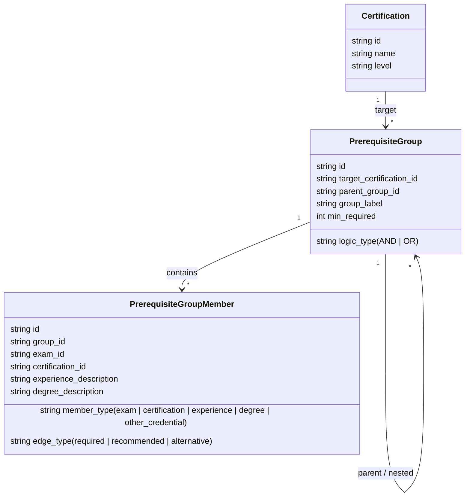

# Data Model Spec — Certifications, Exams, Prerequisites, Ratings & Citations

> This document defines the normalized relational schema, prerequisite rule engine, computed rating formula, and citation tracking requirements for the IT Certification Explorer.

---

## 1. Core Relational Entities

### **Vendor**
- `id` (string, PK, e.g. `"vendor:cisco"`, `"vendor:microsoft"`)
- `name` (string, e.g. `"Cisco Systems"`)
- `short_name` (string, e.g. `"Cisco"`)
- `website_url` (string)
- `logo_asset_ref` (string, local path / public SVG ref)
- `description` (text)
- `founded_year` (integer, optional)
- `notes` (text, optional)

### **Domain**
- `id` (string, PK, e.g. `"domain:linux"`, `"domain:networking"`, `"domain:cybersecurity"`, `"domain:azure"`, `"domain:cloud"`, `"domain:ai-ml"`)
- `name` (string, e.g. `"Networking"`, `"AI & Machine Learning"`)
- `description` (text)
- `is_emerging` (boolean, default `false` — set to `true` for `"domain:ai-ml"` with visual "Rapidly Evolving" badge)

### **Exam**
> *Cost source of truth:* Cost lives exclusively at the `Exam` level. Certifications do not store a static cost column.
- `id` (string, PK, e.g. `"exam:cisco-350-401"`, `"exam:ms-az-104"`)
- `vendor_id` (string, FK -> `Vendor.id`)
- `exam_code` (string, e.g. `"350-401 ENCOR"`, `"AZ-104"`, `"SY0-701"`)
- `name` (string, e.g. `"Implementing and Operating Cisco Enterprise Network Core Technologies"`)
- `format` (enum: `multiple_choice`, `performance_based`, `hands_on_lab`, `mixed`, `oral_defense`)
- `cost_amount_usd` (decimal, official vendor base price)
- `cost_amount_cad_override` (decimal, nullable — official published Canadian retail voucher price if available)
- `duration_minutes` (integer, e.g. `120`)
- `question_count_min` (integer, optional)
- `question_count_max` (integer, optional)
- `passing_score_info` (string, optional, e.g. `"700/1000"`, `"825/1000"`)
- `status` (enum: `active`, `retired`, `being_replaced`)
- `cost_last_verified_date` (date, quarterly audit timestamp)
- `status_last_verified_date` (date, quarterly audit timestamp)
- `official_url` (string)

### **Certification**
- `id` (string, PK, e.g. `"cert:ccnp-enterprise"`, `"cert:azure-solutions-architect"`)
- `vendor_id` (string, FK -> `Vendor.id`)
- `name` (string, e.g. `"Cisco Certified Network Professional Enterprise"`)
- `acronym` (string, e.g. `"CCNP Enterprise"`, `"CISSP"`, `"RHCE"`)
- `level` (enum: `entry`, `associate`, `professional`, `expert`, `specialty`)
- `vendor_level_label` (string, optional, vendor's own tier wording, e.g. `"Expert Tier"`, `"Professional Level"`)
- `status` (enum: `active`, `retired`, `being_replaced`)
- `status_notes` (text, optional, e.g. `"Replacing CASP+ as of late 2024"`)
- `renewal_period_months` (integer, e.g. `36` for 3-year validity, `0` for non-expiring)
- `renewal_requirements_text` (text, e.g. `"80 CEUs or retake qualifying exam"`)
- `description` (text)
- `official_url` (string)
- `computed_score` (decimal, 0–100, recomputed on data updates, never hand-edited)
- `score_breakdown` (jsonb, breakdown of `market_value`, `demand`, `rigor`, `community_perception`, `currency_penalty`)
- `status_last_verified_date` (date)

#### **Derived Certification Cost (Computed, Not Stored)**
To avoid data drift, `Certification` has **no direct cost column**. The API computes and exposes:
- `computed_cost_usd`: Sum of required exams (or `min`-`max` range if elective options have variable prices).
- `computed_cost_cad`: Sum of `cost_amount_cad_override` where available, falling back to cached forex conversion (`cost_amount_usd * daily_usd_cad_rate`).

### **CertificationDomain (Join Table)**
- `certification_id` (string, FK -> `Certification.id`)
- `domain_id` (string, FK -> `Domain.id`)
- *Composite PK: (`certification_id`, `domain_id`)*

### **Role & CertificationRole (Job Role Presets)**
- **Role**: `id` (PK), `name` (e.g. `"Network Engineer"`, `"Cloud Security Architect"`, `"SOC Analyst"`), `description`.
- **CertificationRole**: `certification_id` (FK), `role_id` (FK). Roles act as curated filtering presets across the graph.

---

## 2. Prerequisite & Requirement Rule Engine

Real-world IT certifications have complex multi-exam, prior credential, degree, and experience rules that cannot be modeled as a flat "cert A -> cert B" graph. We use a hierarchical composite pattern:



### **PrerequisiteGroup**
- `id` (string, PK)
- `target_certification_id` (string, FK -> `Certification.id`)
- `parent_group_id` (string, nullable, FK -> `PrerequisiteGroup.id` for nested tree structures)
- `logic_type` (enum: `AND`, `OR`)
- `group_label` (string, e.g. `"Core Exam"`, `"Concentration Elective (Choose 1)"`, `"Experience or Waiver Path"`)
- `min_required` (integer, default `1` for OR groups, or `N` count for AND groups)

### **PrerequisiteGroupMember**
- `id` (string, PK)
- `group_id` (string, FK -> `PrerequisiteGroup.id`)
- `member_type` (enum: `exam`, `certification`, `experience`, `degree`, `other_credential`)
- `exam_id` (string, nullable, FK -> `Exam.id`)
- `certification_id` (string, nullable, FK -> `Certification.id`)
- `experience_description` (text, nullable, e.g. `"5 years cumulative paid work experience across 2+ CISSP CBK domains"`)
- `degree_description` (text, nullable, e.g. `"4-year post-secondary degree in computer science or related field"`)
- `edge_type` (enum: `required`, `recommended`, `alternative`)
- `notes` (text, optional)

### **Default Edge Type & Evaluation Rules**
To ensure rigorous consistency across all 54 flagship certifications:
1. **Members of an `AND` group default to `edge_type = 'required'`**: Every constituent exam or prerequisite credential must be earned.
2. **Members of an `OR` group default to `edge_type = 'alternative'`**: Satisfies one branch of an elective choice or waiver.
3. **`edge_type = 'recommended'`**: Strictly reserved for customary/soft precursors (e.g. CompTIA Network+ before Cisco CCNA, or CCNA before CCNP) where the vendor recommends experience/knowledge but enforces no blocking exam gateway.

---

## 3. Source Citation Model & Referential Integrity

Every factual claim (costs, prerequisite rules, levels, renewal terms) must link to a primary verifiable source.

### **Source**
- `id` (string, PK)
- `type` (enum: `vendor_page`, `salary_survey`, `job_postings_index`, `community_aggregate`, `other`)
- `title` (string, e.g. `"Cisco CCNP Enterprise Program Blueprint"`, `"Skillsoft IT Skills & Salary Report"`)
- `url` (string)
- `publisher` (string, e.g. `"Cisco Systems"`, `"Skillsoft"`, `"CompTIA"`)
- `accessed_date` (date)
- `notes` (text, optional)

### **FieldSource (Join Table)**
- `id` (string, PK)
- `entity_type` (enum: `certification`, `exam`)
- `entity_id` (string)
- `field_name` (string, e.g. `"cost_amount_usd"`, `"prerequisites"`, `"renewal_requirements"`)
- `source_id` (string, FK -> `Source.id`)

### **Polymorphic Integrity & Save Validation Rule**
> **Accepted Architectural Trade-off:** `FieldSource` uses `entity_type` + `entity_id` instead of discrete foreign keys to provide a unified citation interface across both `Certification` and `Exam` rows.
>
> **Enforced Application Rule:** The application layer / ORM repository **must reject any save** where:
> 1. `entity_id` fails to resolve to an active row in the table specified by `entity_type`.
> 2. An editable fact field on `Certification` or `Exam` is created or modified without at least one corresponding `FieldSource` citation entry.

---

## 4. Rating Score: Formula & Weights

All scores are normalized 0–100 and recomputed server-side on data updates:

$$\text{raw\_score} = 0.30 \times \text{MarketValue} + 0.30 \times \text{Demand} + 0.20 \times \text{Rigor} + 0.20 \times \text{CommunitySentiment}$$

$$\text{overall\_score} = \text{raw\_score} \times \text{currency\_multiplier}$$

### Sub-Score Inputs (Zero-Cost Open Data Strategy)
1. **Market Value Score (30%)**: Derived from publicly reported median salaries in annual vendor/industry surveys (Skillsoft summary reports, BLS IT wage benchmarks, Dice).
2. **Demand Score (30%)**: Derived from periodic sampling of public job posting indices and hiring benchmarks for cert mentions.
3. **Rigor Score (20%)**: Derived from exam testing format:
   - Hands-on Lab / 24-hr Practical (e.g. OSCP, RHCSA/RHCE, CCIE): `90–100`
   - Performance-Based + Multiple Choice (e.g. CompTIA CySA+/SecurityX, Azure Associates): `65–85`
   - Pure Multiple Choice / Foundational: `30–60`
4. **Community Perception Score (20%)**: Aggregated practitioner sentiment from structured recurring forum/community discussions.
5. **Currency Multiplier**:
   - Active: `1.0`
   - Being Replaced: `0.85`
   - Retired: `0.50`

Every certification detail view displays the full sub-score breakdown with confidence ratings and source links.

---

## 5. Graph Export Schema (JSON for Visualization)

The backend pre-computes a consolidated graph payload consumed by both React Flow (DAG tree view) and D3 (Force-directed and Radial views):

```json
{
  "nodes": [
    {
      "id": "cert:ccna",
      "label": "CCNA",
      "fullName": "Cisco Certified Network Associate",
      "vendor": "cisco",
      "vendorLabel": "Cisco",
      "domains": ["networking"],
      "level": "associate",
      "status": "active",
      "score": 78,
      "scoreBreakdown": {
        "marketValue": 75,
        "demand": 88,
        "rigor": 65,
        "community": 80
      },
      "computedCostUsd": 300.0,
      "computedCostCad": 415.0,
      "renewalMonths": 36,
      "examSummary": "200-301 CCNA"
    }
  ],
  "edges": [
    {
      "id": "edge:ccna-to-ccnp-core",
      "source": "cert:ccna",
      "target": "cert:ccnp-enterprise",
      "type": "recommended",
      "label": "Recommended precursor"
    },
    {
      "id": "edge:az104-to-az305",
      "source": "cert:azure-administrator",
      "target": "cert:azure-solutions-architect",
      "type": "required",
      "label": "Formal prerequisite certification"
    }
  ]
}
```
